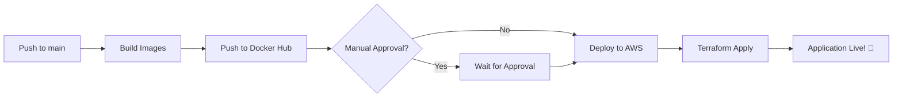

# CI/CD Pipeline Deployment Guide

## 🎯 Overview

Your project now has a **complete CI/CD pipeline** that includes:
1. ✅ Build Docker Images
2. ✅ Push to Docker Hub
3. ✅ Deploy to AWS via Terraform

## 📊 Pipeline Stages

```
┌─────────────────────────────────────────────────────────────┐
│  GitHub Actions Pipeline (Complete CI/CD)                   │
├─────────────────────────────────────────────────────────────┤
│                                                              │
│  Stage 1: Build and Push Frontend Image (48s)               │
│           ├── Checkout code                                  │
│           ├── Build Docker image                             │
│           └── Push to Docker Hub                             │
│                                                              │
│  Stage 2: Build and Push Backend Image (30s)                │
│           ├── Checkout code                                  │
│           ├── Build Docker image                             │
│           └── Push to Docker Hub                             │
│                                                              │
│  Stage 3: Update Docker Compose (4s)                         │
│           └── Create deployment notification                 │
│                                                              │
│  Stage 4: Deploy to AWS with Terraform (NEW! ⭐)            │
│           ├── Configure AWS credentials                      │
│           ├── Terraform init                                 │
│           ├── Terraform plan                                 │
│           ├── Terraform apply                                │
│           └── Output deployment URLs                         │
│                                                              │
└─────────────────────────────────────────────────────────────┘
```

## 🔧 Setup Required

### Required GitHub Secrets

Add these secrets in: **Settings → Secrets and variables → Actions → New repository secret**

#### Docker Hub Secrets (Already configured ✅)
- `DOCKERHUB_USERNAME` - Your Docker Hub username
- `DOCKERHUB_TOKEN` - Docker Hub access token

#### AWS Secrets (NEW - Need to add ⚠️)
- `AWS_ACCESS_KEY_ID` - Your AWS access key
- `AWS_SECRET_ACCESS_KEY` - Your AWS secret key
- `AWS_REGION` - AWS region (e.g., `us-east-1`)

#### Application Secrets
- `DB_PASSWORD` - Database password for RDS

### How to Get AWS Credentials

1. **Log in to AWS Console**
2. **Go to IAM → Users → Your User → Security credentials**
3. **Create Access Key** → Select "CLI" → Create
4. **Copy the Access Key ID and Secret Access Key**
5. **Add them to GitHub Secrets**

## 🎛️ Deployment Options

### Option 1: Fully Automated (Current Configuration)

**When it triggers:**
- Every push to `main` branch
- Automatically builds, pushes, and deploys

**Pros:**
- ✅ Fully automated end-to-end
- ✅ Fast deployment
- ✅ No manual intervention

**Cons:**
- ⚠️ No approval gate before production
- ⚠️ Immediate deployment (no rollback window)

### Option 2: Manual Approval (Recommended for Production)

Add environment protection rules:

1. Go to **Settings → Environments → production**
2. Enable **Required reviewers**
3. Add yourself as a reviewer
4. Now deployments will wait for manual approval

### Option 3: Separate CI and CD

**Keep current GitHub Actions for CI only:**
- Build and push Docker images
- Comment out or remove the `deploy-to-aws` job

**Use separate tools for CD:**
- Jenkins for deployment
- Manual Terraform commands
- AWS CodePipeline

## 🚀 Deployment Flow

### Automatic Deployment Flow



### Current Status

**✅ Working:**
- Build and Push Frontend Image
- Build and Push Backend Image
- Update Docker Compose notification

**🆕 Added (Requires setup):**
- Deploy to AWS with Terraform

**⚠️ To activate the new stage:**
1. Add AWS secrets to GitHub
2. The pipeline will automatically deploy on next push to `main`

## 📝 Terraform Variables

Your Terraform expects these variables (already configured):
- `dockerhub_username` - Passed from secrets
- `frontend_image_tag` - Set to "latest"
- `backend_image_tag` - Set to "latest"
- `db_password` - Passed from secrets

## 🔍 Monitoring Deployments

### View Pipeline Status
- Go to **Actions** tab in GitHub
- Click on the latest workflow run
- See all stages and their status

### View Terraform Outputs
After deployment completes, check the logs for:
- Frontend URL
- Backend URL
- RDS endpoint

## 🛡️ Security Best Practices

1. **Never commit secrets** - Use GitHub Secrets
2. **Use environment protection** - Enable manual approval for production
3. **Review Terraform plans** - Check what will change before applying
4. **Backup Terraform state** - Use S3 backend (recommended)
5. **Rotate AWS keys regularly** - Every 90 days

## 🎚️ Pipeline Control

### Disable AWS Deployment

If you want to keep CI only (current behavior):

```yaml
# Comment out this section in .github/workflows/docker-build-push.yml
# deploy-to-aws:
#   ...entire job...
```

### Enable AWS Deployment

1. Add required AWS secrets
2. Push to `main` branch
3. Pipeline will automatically deploy

## 📞 Troubleshooting

### Deployment Stage Not Running?
- Check if AWS secrets are configured
- Verify the `if` condition in workflow file
- Ensure you're pushing to `main` branch

### Terraform Errors?
- Check AWS credentials are valid
- Verify Terraform state is accessible
- Review Terraform plan output

### Want to Deploy Manually?
```bash
cd terraform
terraform init
terraform plan
terraform apply
```

## 🎯 Recommendations

**For Development/Learning:** ✅ Use fully automated deployment

**For Production:** ⚠️ Add manual approval gate

**For Team Projects:** 🔒 Use environment protection with multiple reviewers

---

## 📚 Next Steps

1. **Add AWS secrets** to enable deployment stage
2. **Test the pipeline** with a small commit
3. **Monitor the deployment** in Actions tab
4. **Verify application** is running on AWS
5. **Set up monitoring** (CloudWatch, etc.)
